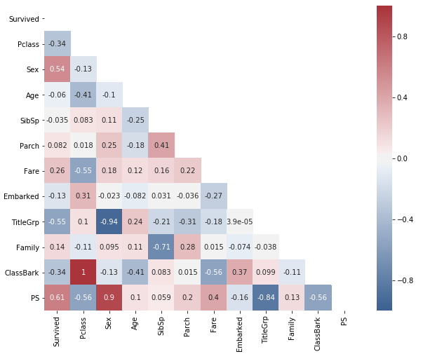

# Kaggle Titanic Survival Prediction
Predicting whether the passengers in the infamous RMS Titanic shipwreck survived or not. This is a basic project to kickstart
your Kaggle and Data Science journey.  
 
## The Feature Correlation
The correlation of features used in this project:  

 
## Project Folder Structure
.  
├── forecast-scikit.yml  
├── Data Preparation 1.ipynb  
└── Random Forest 1.ipynb  
└── data  
&nbsp;&nbsp;&nbsp;&nbsp;├── train.csv  
&nbsp;&nbsp;&nbsp;&nbsp;└── test.csv  
└── predictions  
&nbsp;&nbsp;&nbsp;&nbsp;└── my_prediction.csv  

The **data** folder *should* contain our train and test data in the csv format. Following the regulations of Kaggle,
I am not uploading the data here. In order to get this data yourself, you can enter the Kaggle competition-
[Titanic: Machine Learning from Disaster](https://www.kaggle.com/c/titanic).
  
The **predictions** folder is used to save the csv file containing our predictions. It will be available once you
properly run model.
 
 
## Changing the conda environment name (Optional)
*It's best to avoid this step if you don't want to do a little hassle.*  
By default, in the The forecast-scikit.yml contains the settings for an environment named *kgl-forecast*.  
You can change the name, if you want to by editing the first line of the file as follows.  
change  
> name: kgl-forecast  

to  

> name: *your_environment_name*  

But, if you perform this step, remember to use *your environment name* instead of kgl-forecast.
 
 
## Creating the conda environment
You can create the predefined conda environment using the forecast-scikit.yml file using the following command:
> conda env create -f forecast-scikit.yml  

## Activating the conda environment
You can use the following command to activate the conda environement:  
> source activate kgl-forecast  

  
## Opening the Notebook
To open notebooks of current folder, you need to first activate the environment using instructions from the previous
step. Then, you can just use the following command and navigate to the required notebook:
> jupyter notebook  

## Preparing the data
To prepare the data open the *Data Preparation 1.ipynb* file and in the *Kernel* menu, choose *Restart and run all*.
You can also manually change the code and *Restart and clear ouptput* run the code block by block using *Shift+Enter*. 
Again, you need to have the requiured train.csv and test.csv from the Kaggle competition.
 
## Fitting the model
To fit the model, open the *Random Forest 1.model* and again, you can choose the restart and run all from the kernel
menu or just run the code manually block by block.

---
*That's all folks* If you come up with an error or get confused in any step, just google it first.
But if you are still not able to get a solution, feel free to contact me through my email.
I will help as much as possible.
